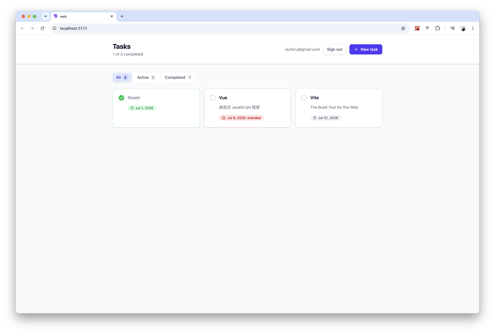
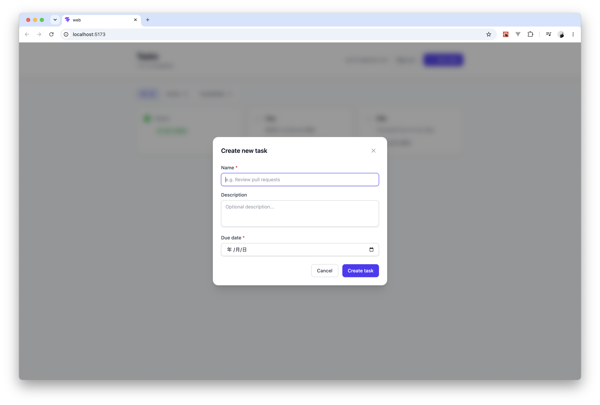
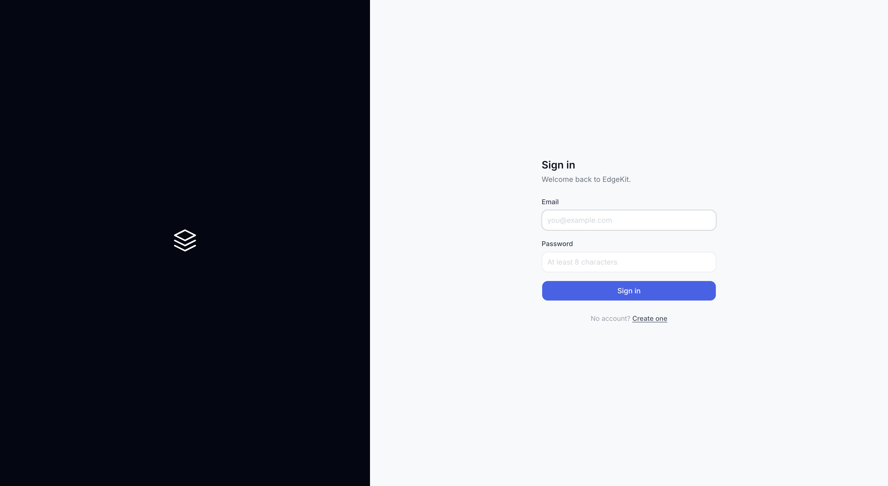

# EdgeKit

A full-stack project management platform built with React, Hono and Cloudflare Workers.

## Screenshots

<p align="center">
  
</p>

<p align="center">
  
</p>

<p align="center">
  
</p>

## Tech Stack

### Frontend (`apps/web`)

- **React 19** — UI framework
- **Vite 8** — Build tool
- **Tailwind CSS 4** — Styling
- **shadcn/ui** — Component library (Base UI + Tailwind)
- **Hono RPC** — End-to-end type-safe API client

### Backend (`apps/api`)

- **Hono** — HTTP framework (runs on Cloudflare Workers)
- **Drizzle ORM** — Database toolkit
- **Cloudflare D1** — Serverless SQL database
- **Chanfana** — OpenAPI documentation
- **jose** — JWT authentication
- **bcryptjs** — Password hashing

### Shared (`packages/shared`)

- **Zod** — Schema validation & type inference
- RBAC permission system

## Getting Started

### Prerequisites

- Node.js >= 20
- pnpm >= 9

### Installation

```bash
git clone https://github.com/your-username/edgekit.git
cd edgekit
pnpm install
```

### Local Development

```bash
# Start both API and Frontend
pnpm dev

# Or separately
pnpm dev:web    # Frontend only (http://localhost:5173)
pnpm dev:api    # Backend only (http://localhost:8787)
```

The frontend proxies `/api` requests to the backend automatically.

### Database Setup

For local development (uses Miniflare/D1 local):

```bash
cd apps/api
npx wrangler d1 execute edgekit-db --local --file=./schema.sql
```

For production (Cloudflare Workers):

```bash
# Create remote D1 database
npx wrangler d1 create edgekit-db

# Update database_id in wrangler.jsonc

# Apply schema
npx wrangler d1 execute edgekit-db --remote --file=./schema.sql
```

## Project Structure

```
edgekit/
├── apps/
│   ├── web/                        # React frontend
│   │   └── src/
│   │       ├── features/
│   │       │   ├── auth/           # Authentication (login, register, session)
│   │       │   ├── workspace/      # Workspace management & layout
│   │       │   ├── project/        # Project CRUD
│   │       │   └── issue/          # Issue tracking & filtering
│   │       ├── components/
│   │       │   ├── ui/             # shadcn/ui components
│   │       │   └── layout/         # Shared layout (Header, ErrorToast, etc.)
│   │       └── lib/                # API client, utilities
│   ├── api/                        # Cloudflare Worker backend
│   │   ├── schema.sql              # D1 table definitions
│   │   └── src/
│   │       ├── modules/
│   │       │   ├── auth/           # Register, login, session, permissions
│   │       │   ├── workspace/      # CRUD + member management
│   │       │   ├── project/        # CRUD operations
│   │       │   └── issue/          # CRUD operations
│   │       ├── db/                 # Drizzle schema & client
│   │       └── middleware/         # Auth & RBAC middleware
│   └── shared/                     # Shared types & Zod schemas
├── docs/
│   ├── TodoList.md                 # Development roadmap (Phase 0-9)
│   ├── devlog.md                   # Development log
│   └── adr/                        # Architecture Decision Records
└── screenshot/                     # UI screenshots
```

## Features

### Authentication & Authorization

- Register / Login / Logout (JWT + HttpOnly cookies)
- Role-Based Access Control (RBAC)
- Four roles: OWNER, ADMIN, MEMBER, VIEWER
- Granular permissions: workspace, project, issue, member management

### Workspace Management

- Create workspaces with auto-generated slugs
- Switch between workspaces via dropdown
- Member invitation and role management
- Per-workspace role-based UI controls

### Project & Issue Tracking

- CRUD operations for projects and issues
- Issue filtering (All / Active / Completed)
- Status and priority management
- Assignee support

### API

- Automatic OpenAPI documentation (Swagger UI)
- Hono RPC end-to-end type safety
- Workspace-scoped data isolation

## Development

```bash
pnpm dev              # API + Frontend in parallel
pnpm dev:web          # Frontend only
pnpm dev:api          # Backend only
pnpm typecheck        # TypeScript type checking
pnpm lint             # OxLint
pnpm fmt              # Oxfmt
pnpm test             # Run all tests (shared + api + web)
```

### Testing

The project uses **Vitest** with **React Testing Library** for comprehensive test coverage.

```bash
pnpm test                        # Run all tests
pnpm --filter @edgekit/shared test  # Shared package tests only
pnpm --filter api test            # API tests only
pnpm --filter web test            # Frontend tests only
```

**Test coverage:**

- **Shared**: RBAC permissions (20 tests), Zod schemas (13 tests)
- **API**: Auth flow (14 tests), Database CRUD (14 tests), Route basics (7 tests)
- **Frontend**: Button component (8 tests), Utility functions (7 tests), Query hooks (5 tests)

### Database

```bash
# Apply migrations locally
pnpm --filter api db:migrate:local

# Apply migrations to remote D1
pnpm --filter api db:migrate:remote

# Generate new migration from schema changes
pnpm --filter api db:generate

# Push schema directly to local D1 (dev shortcut)
pnpm --filter api db:push
```

## Deployment

### Prerequisites

Set the following GitHub repository secrets:

- `CLOUDFLARE_API_TOKEN` — Cloudflare API token with Workers & Pages permissions
- `CLOUDFLARE_ACCOUNT_ID` — Your Cloudflare account ID

### Automatic Deployment

Push to `main` branch. GitHub Actions will:

1. Run CI checks (lint, typecheck, test, build)
2. Deploy API to Cloudflare Workers
3. Deploy frontend to Cloudflare Pages
4. Apply DB migrations when schema changes (separate workflow)

### Manual Deployment

```bash
# Deploy API (Cloudflare Workers)
pnpm deploy:api

# Build frontend
pnpm deploy:web

# Deploy frontend manually via Wrangler
cd apps/web && npx wrangler pages deploy dist --project-name=edgekit-web
```

## Roadmap

See [docs/TodoList.md](docs/TodoList.md) for the full development plan.

- [x] Phase 0: Project baseline
- [x] Phase 1: Database model upgrade
- [x] Phase 2: Backend API refactor
- [x] Phase 3: RBAC permission system
- [x] Phase 4: React architecture upgrade + workspace UI
- [x] Phase 5: TanStack Query integration
- [x] Phase 6: Advanced interactions
- [x] Phase 7: React performance optimization
- [x] Phase 8: Engineering best practices
- [x] Phase 9: Deployment

## License

MIT
